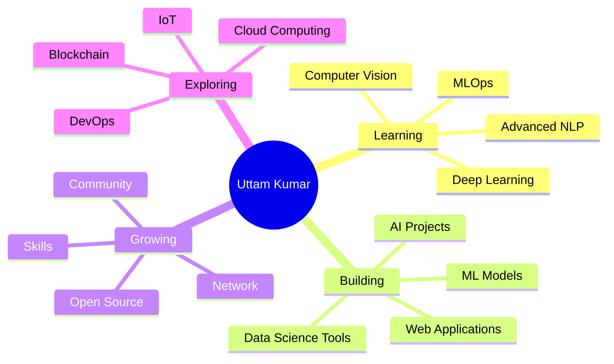

<div align="center">
  
</div>

<h1 align="center">
  
</h1>

<div align="center">

  <!-- Profile Picture with Animated Border -->
  

<br><br>

  <!-- Badges -->
  
  
  

</div>

<br>

<p align="center">
  
</p>

<br>

## 💫 About Me

<div align="center">


<br><br>

### 👋 Hello! I'm Uttam Kumar

</div>

<table align="center">
  <tr>
    <td align="center" width="50%">
      <br>
      <b>👤 Name</b><br>
      Uttam Kumar<br>
      @uttamkqr
    </td>
    <td align="center" width="50%">
      <br>
      <b>💼 Role</b><br>
      Data Science Enthusiast<br>
      ML Engineer
    </td>
  </tr>
  <tr>
    <td align="center" width="50%">
      <br>
      <b>🎓 Education</b><br>
      B.Tech in Computer Science<br>
      Guru Kashi University
    </td>
    <td align="center" width="50%">
      <br>
      <b>📍 Location</b><br>
      Bathinda, Punjab<br>
      India 🇮🇳
    </td>
  </tr>
</table>

<br>

<div align="center">

### 💻 Programming Languages

Python • C • C++ • JavaScript • SQL • HTML • CSS

### 🎯 Areas of Interest

Machine Learning • Data Science • Artificial Intelligence  
Computer Vision • Natural Language Processing • Web Development

### 🌱 Currently Learning

Deep Learning • Computer Vision • Advanced NLP • MLOps

### 📫 Contact Me

📧 **Email:** [uttam16.kqr@gmail.com](mailto:uttam16.kqr@gmail.com)  
📱 **Phone:** [+91 82524 43170](tel:+918252443170)  
🌐 **Portfolio:** [uttamkqr.github.io/portfolio](https://uttamkqr.github.io/portfolio)

</div>

<br>

<div align="center">
  
</div>

<br>

> 💡 **"Thanks for dropping by! Let's connect and build something amazing together! 🚀"**

<p align="center">
  
</p>

---

<br>

## 🎯 Quick Facts

<div align="center">

| 🎓 Education | 💼 Role | 📍 Location | 🌐 Portfolio |
|:---:|:---:|:---:|:---:|
| B.Tech CSE | ML Engineer | Punjab, India | [Visit](https://uttamkqr.github.io/portfolio) |

</div>

<br>

<table align="center">
  <tr>
    <td align="center" width="50%">
      <br>
      <b>🎓 Student at Guru Kashi University</b><br>
      <i>B.Tech in Computer Science Engineering</i><br>
      CGPA: 7.50 | Expected: 2026
    </td>
    <td align="center" width="50%">
      <br>
      <b>🚀 Data Science Enthusiast</b><br>
      <i>Passionate about AI & Machine Learning</i><br>
      Building innovative solutions
    </td>
  </tr>
  <tr>
    <td align="center" width="50%">
      <br>
      <b>💻 Active Developer</b><br>
      <i>10+ Projects | 29+ Contributions</i><br>
      Python • ML • Web Development
    </td>
    <td align="center" width="50%">
      <br>
      <b>🌱 Always Learning</b><br>
      <i>Deep Learning • Computer Vision • NLP</i><br>
      Exploring new technologies daily
    </td>
  </tr>
</table>

<br>

<div align="center">
  
  
  
</div>

---

<br>

## 🛠️ Tech Stack & Skills

<p align="center">
  
</p>

<br>

### 📊 Data Science & Machine Learning

<p align="center">
  
  
  
  
  
  
  
  
  
  
</p>

### 💻 Programming Languages

<p align="center">
  
  
  
  
  
  
  
</p>

### 🌐 Web Development

<p align="center">
  
  
  
  
  
  
  
</p>

### 🗄️ Databases

<p align="center">
  
  
  
  
  
</p>

### 🔧 Tools & Technologies

<p align="center">
  
  
  
  
  
  
  
  
</p>

<br>

<p align="center">
  
</p>

---

<br>

## 📈 GitHub Statistics

<div align="center">

  
  

</div>

<br>

<div align="center">

  
  

</div>

<br>

<div align="center">
  
</div>

<br>

---

<br>

## 🏆 GitHub Trophies

<div align="center">
  
</div>

<br>

---

<br>

## 🐍 Contribution Snake Game

<div align="center">

  <!-- Snake eating contributions -->
  <picture>
    <source media="(prefers-color-scheme: dark)" srcset="https://raw.githubusercontent.com/uttamkqr/uttamkqr/output/github-contribution-grid-snake-dark.svg">
    <source media="(prefers-color-scheme: light)" srcset="https://raw.githubusercontent.com/uttamkqr/uttamkqr/output/github-contribution-grid-snake.svg">
    
  </picture>

</div>

<br>

---

<br>

## 🚀 Featured Projects

<table width="100%">
  <tr>
    <td width="50%" align="center">
      <div>
        <h3>🤖 AI Career Buddy</h3>
        <a href="https://github.com/uttamkqr/AI-CAREER-BUDDY" target="_blank">
          
        </a>
        <p>
          
          
          
        </p>
        <p><i>AI-powered career guidance platform with ML algorithms</i></p>
      </div>
    </td>
    <td width="50%" align="center">
      <div>
        <h3>🎓 Smart College Web</h3>
        <a href="https://github.com/uttamkqr/SmartCollegeWeb" target="_blank">
          
        </a>
        <p>
          
          
          
        </p>
        <p><i>Modern responsive college website with student portal</i></p>
      </div>
    </td>
  </tr>
  <tr>
    <td width="50%" align="center">
      <div>
        <h3>🎯 Smart Quiz Bot</h3>
        <a href="https://github.com/uttamkqr/my-smart-quiz-bot" target="_blank">
          
        </a>
        <p>
          
          
        </p>
        <p><i>Intelligent quiz application with real-time analytics</i></p>
      </div>
    </td>
    <td width="50%" align="center">
      <div>
        <h3>🎨 AIR DRAW</h3>
        <a href="https://github.com/uttamkqr/AIR-DRAW" target="_blank">
          
        </a>
        <p>
          
          
          
        </p>
        <p><i>Computer vision air drawing with hand tracking</i></p>
      </div>
    </td>
  </tr>
  <tr>
    <td width="50%" align="center">
      <div>
        <h3>🎤 Instant Voice Interface</h3>
        <a href="https://github.com/uttamkqr/instant-voice-interface" target="_blank">
          
        </a>
        <p>
          
          
        </p>
        <p><i>Voice-controlled interface with speech recognition</i></p>
      </div>
    </td>
    <td width="50%" align="center">
      <div>
        <h3>🏢 QuickDesk</h3>
        <a href="https://github.com/uttamkqr/quickdesk" target="_blank">
          
        </a>
        <p>
          
          
        </p>
        <p><i>Productivity tool with task management system</i></p>
      </div>
    </td>
  </tr>
</table>

<br>

<div align="center">
  <a href="https://github.com/uttamkqr?tab=repositories" target="_blank">
    
  </a>
</div>

<br>

---

<br>

## 💼 What I'm Working On



<br>

---

<br>

## 🎯 Current Focus

<table align="center">
  <tr>
    <td align="center" width="33%">
      <br>
      <b>🔭 Working On</b><br>
      AI-powered applications<br>
      ML project development
    </td>
    <td align="center" width="33%">
      <br>
      <b>🌱 Learning</b><br>
      Deep Learning<br>
      Computer Vision & NLP
    </td>
    <td align="center" width="33%">
      <br>
      <b>👯 Collaborating</b><br>
      Machine Learning projects<br>
      Open source contributions
    </td>
  </tr>
  <tr>
    <td align="center" width="33%">
      <br>
      <b>💬 Ask Me About</b><br>
      Python, Data Science<br>
      ML, Web Development
    </td>
    <td align="center" width="33%">
      <br>
      <b>⚡ Fun Fact</b><br>
      I turn coffee into code<br>
      ☕➡️💻
    </td>
    <td align="center" width="33%">
      <br>
      <b>🎯 Goal</b><br>
      Build innovative AI solutions<br>
      Impact millions
    </td>
  </tr>
</table>

<br>

---

<br>

## 📊 Weekly Development Breakdown

<!--START_SECTION:waka-->

```text
Python       12 hrs 30 mins  ████████████░░░░░░░░░  55.2%
JavaScript    4 hrs 15 mins  ████░░░░░░░░░░░░░░░░░  18.8%
HTML/CSS      3 hrs 20 mins  ███░░░░░░░░░░░░░░░░░░  14.7%
SQL           1 hr 30 mins   █░░░░░░░░░░░░░░░░░░░░   6.6%
Other         1 hr 05 mins   █░░░░░░░░░░░░░░░░░░░░   4.7%
```

<!--END_SECTION:waka-->

<br>

<div align="center">
  
</div>

<br>

---

<br>

## 💡 Random Dev Quote

<div align="center">
  
</div>

<br>

---

<br>

<div align="center">
  
</div>

<br>

## 🤝 Connect With Me

<p align="center">
  <a href="https://github.com/uttamkqr" target="_blank">
    
  </a>
  <a href="https://linkedin.com/in/uttam-kumar-7b69522b7" target="_blank">
    
  </a>
  <a href="mailto:uttam16.kqr@gmail.com">
    
  </a>
  <a href="https://wa.me/918252443170" target="_blank">
    
  </a>
  <a href="https://orcid.org/0009-0000-8099-5594" target="_blank">
    
  </a>
  <a href="https://uttamkqr.github.io/portfolio" target="_blank">
    
  </a>
  <a href="https://twitter.com/uttamkqr" target="_blank">
    
  </a>
  <a href="https://instagram.com/uttamkqr" target="_blank">
    
  </a>
</p>

<br>

<div align="center">
  
</div>

<br>

## 📫 Get In Touch

<p align="center">
  <i>✨ Feel free to reach out if you want to collaborate on projects, discuss tech, or just say hi! ✨</i>
</p>

<table align="center">
  <tr>
    <td align="center" width="25%">
      <br>
      <b>📧 Email</b><br>
      <a href="mailto:uttam16.kqr@gmail.com">uttam16.kqr@gmail.com</a>
    </td>
    <td align="center" width="25%">
      <br>
      <b>📱 Phone</b><br>
      <a href="tel:+918252443170">+91 82524 43170</a>
    </td>
    <td align="center" width="25%">
      <br>
      <b>🌐 Portfolio</b><br>
      <a href="https://uttamkqr.github.io/portfolio">Visit Website</a>
    </td>
    <td align="center" width="25%">
      <br>
      <b>📍 Location</b><br>
      Bathinda, Punjab, India
    </td>
  </tr>
</table>

<br>

---

<br>

## 🎮 Interactive Profile Widgets

<div align="center">

### 🎵 Now Playing on Spotify

[](https://spotify-github-profile.vercel.app/api/view?uid=uttamkqr&redirect=true)

</div>

<br>

<div align="center">

### 💻 This Week I Spent My Time On

<!--START_SECTION:waka-->
<!--END_SECTION:waka-->

</div>

<br>

---

<br>

## 🎨 GitHub Metrics

<div align="center">

  

</div>

<br>

---

<br>

## 🏅 Achievements & Certifications

<div align="center">

| 🎓 Certification | 🏢 Organization | 📅 Year | 🔗 Link |
|:---:|:---:|:---:|:---:|
| Python for Data Science | IBM | 2024 | [View](https://www.coursera.org) |
| Machine Learning | Stanford | 2024 | [View](https://www.coursera.org) |
| Deep Learning Specialization | DeepLearning.AI | 2024 | [View](https://www.coursera.org) |
| Web Development Bootcamp | Udemy | 2023 | [View](https://www.udemy.com) |

</div>

<br>

---

<br>

## 📚 Latest Blog Posts

<!-- BLOG-POST-LIST:START -->

- 🤖 [Understanding Neural Networks: A Beginner's Guide](#)
- 📊 [Data Science in 2024: Trends and Predictions](#)
- 🐍 [Python Best Practices for ML Projects](#)
- 🚀 [Building Your First AI Application](#)
- 💡 [Tips for Aspiring Data Scientists](#)

<!-- BLOG-POST-LIST:END -->

<br>

---

<br>

## 💭 Random Developer Joke

<div align="center">

  

</div>

<br>

---

<br>

## 🌟 Support My Work

<p align="center">
  <i>If you like my work, consider giving a ⭐ to my repositories and following me for more awesome projects!</i>
</p>

<div align="center">

  <a href="https://github.com/uttamkqr?tab=repositories">
    
  </a>
  <a href="https://github.com/uttamkqr?tab=followers">
    
  </a>
  <a href="https://www.buymeacoffee.com/uttamkqr">
    
  </a>

</div>

<br>

---

<br>

<div align="center">

  

</div>

<br>

<p align="center">
  
</p>

<br>

<div align="center">

  

</div>

---

<p align="center">
  
  
  
</p>

<p align="center">
  <i>⭐ From <a href="https://github.com/uttamkqr">uttamkqr</a> with ❤️ | Profile Views: </i>
</p>

<div align="center">
  
  
  
</div>
